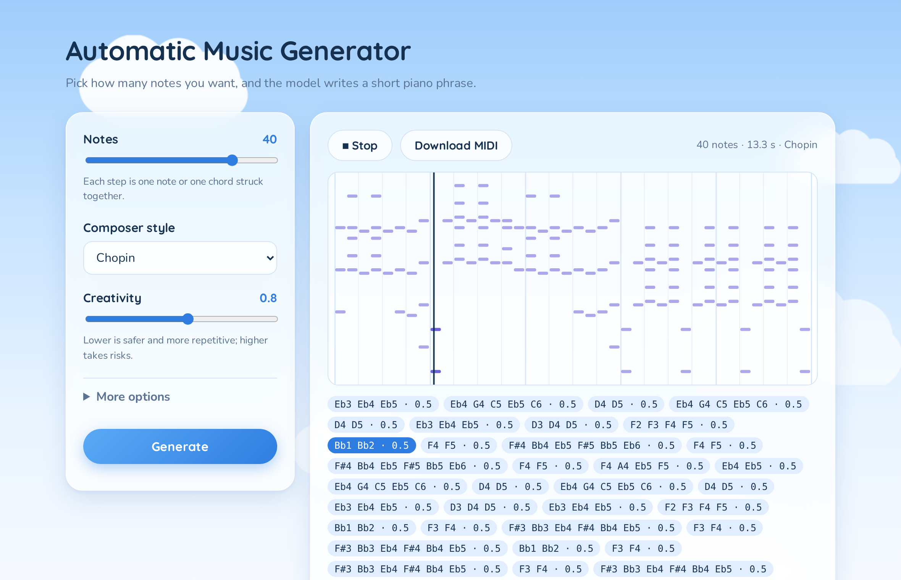

# Automatic Music Generator 2.0

A Transformer that writes new classical piano music, note by note, in the style of 19 composers, with a small web app to try it in your browser.



Pick a length and a composer, press **Generate**, and the model writes a short passage. You can play it in the browser and download it as a MIDI file.

**▶ Try it in your browser: [aicloudcoding.github.io/automatic_music_generator_v2](https://aicloudcoding.github.io/automatic_music_generator_v2/)** — nothing to install, works on phones.

## Run it on your computer

A trained model is included in `pretrained/transformer/`, so the web app works right away, even without a GPU. TensorFlow needs **Python 3.10–3.13**; newer Ubuntu releases ship 3.14, so the steps below use [uv](https://docs.astral.sh/uv/) to get Python 3.12 without touching your system Python.

**Linux, macOS or WSL:**

```bash
git clone https://github.com/aicloudcoding/automatic_music_generator_v2.git
cd automatic_music_generator_v2
curl -LsSf https://astral.sh/uv/install.sh | sh && source $HOME/.local/bin/env
uv venv --python 3.12 .venv
source .venv/bin/activate
uv pip install -r requirements.txt
uv pip install -e .
python -m amg.web
```

**Windows (PowerShell), with Python 3.10–3.13 installed from python.org:**

```powershell
git clone https://github.com/aicloudcoding/automatic_music_generator_v2.git
cd automatic_music_generator_v2
py -3.12 -m venv .venv
.venv\Scripts\activate
pip install -r requirements.txt
pip install -e .
python -m amg.web
```

Then open **http://localhost:8000**. The first install downloads TensorFlow (several hundred MB), so it takes a few minutes.

## The browser version

The link above runs the same trained Transformer entirely in the visitor's browser, so it can be hosted for free on GitHub Pages with no server:

- `python -m amg.export_web` writes the site to `docs/`: the same page as the Python app, the weights as a 9.8 MB half-precision file, and a few openings per composer.
- `src/amg/web/browser/engine.js` is the model in JavaScript. It feeds one token at a time and keeps each layer's keys and values, so a new note only costs a small pass. The heavy matrix math runs in WebAssembly with SIMD (`kernels.wat`), with a plain JavaScript fallback. It runs in a Web Worker so the page stays responsive.
- It matches the Keras model: the same top prediction at all 512 positions of a held-out window, with probabilities within 0.0015 (the difference comes from storing the weights at half precision). `tests/test_browser.py` checks this, plus decoding and MIDI output, against the Python code.
- A 50-note piece takes about a second on a laptop.

To publish your own model, run the export and push `docs/`; in the repo's **Settings → Pages**, deploy from the `main` branch, `/docs` folder.

## Results

How often each model predicts the next token correctly on **44 pieces it never saw during training**. Both models use the same tokens and the same test pieces, so the numbers compare directly.

| Model | Memory | Next-token accuracy | Top-5 |
|---|---|---|---|
| Always guess the most common token | – | 23.2% | – |
| LSTM (2 × 512 units, 3.6M parameters) | 192 tokens | 50.2% | 79.4% |
| **Transformer** (6 layers, 4.9M parameters) | 512 tokens | **70.9%** | 88.8% |

Both were trained on an RTX 3060 with every piece shifted into random keys. The LSTM started overfitting after 12 epochs (about 2 hours). The Transformer kept improving, slowly by the end, for about 60 epochs (about 1.5 hours), helped by its longer memory and its ability to look straight back at earlier motifs.

## How it works

1. **Read the music.** 295 piano pieces by 19 composers from [piano-midi.de](http://www.piano-midi.de/). Notes are grouped by the moment they're struck, and the time to the next moment is snapped to a sixteenth through a whole note.
2. **Turn it into tokens.** Every struck key is a token with its exact pitch, and every step forward in time is another. A C major chord over a low C, held for one beat, is:
   ```
   P36 P60 P64 P67 T1.0
   ```
   That's 97 possible tokens in all: 88 keys, 8 time steps and an unknown-token marker.
3. **Learn what comes next.** A small GPT-style Transformer reads the last 512 tokens (about 165 notes or chords) and predicts the next one. It uses causal self-attention, so it can't peek ahead, and a learned embedding for each composer's style. During training, each window is moved into a random key, up to 5 semitones up or down, which effectively gives the model 11× more data.
4. **Write something new.** Generation starts from a few bars of a real piece by the chosen composer (one held out from training where possible), then samples one token at a time. **Creativity** (temperature) controls how often it picks a less likely option, and **top-k** limits it to the k most likely tokens.

The whole pipeline is in `src/amg/`: `tokens.py` (MIDI ↔ tokens), `data.py` (splits and streamed training windows), `model.py` (LSTM and Transformer), `train.py`, `generate.py` and `web/` (FastAPI server and the page).

## From v1 to v2

[v1](https://github.com/aicloudcoding/automatic_music_generator) was my Summer 2024 project: a single notebook adapted from a tutorial, trained on the CPU. It reported 49% validation accuracy, but that number was inflated, because the same music appeared in both training and validation, and its generation code was broken. v2 is a rebuild as a tested Python package, trained on a GPU:

| | v1 (2024) | v2 |
|---|---|---|
| Notes | Pitches only; every note a quarter note | Exact pitch of every note, plus rhythm |
| Chords | Notes from separate voices interleaved | Notes struck together stay together, with their real voicing |
| Model | LSTM on raw token numbers | LSTM or Transformer with learned embeddings and composer style |
| Validation | Random split of overlapping windows | Whole pieces held out, so the score is honest |
| Training | Fixed 80 epochs on CPU | Early stopping, checkpoints and learning-rate schedule, on an NVIDIA GPU via WSL2 |
| Generation | Random noise as input | Real opening from an unseen piece, with temperature and top-k sampling |
| Data | 29 Schubert pieces | 295 pieces by 19 composers, randomly transposed |

v2 was built with help from Claude (Anthropic) as an AI coding assistant.

## Train your own

Training works on a CPU but is much faster on an NVIDIA GPU. On Windows, TensorFlow only uses the GPU through WSL2:

1. Install WSL2 with Ubuntu (`wsl --install` in an admin PowerShell) and keep your Windows NVIDIA driver up to date.
2. Keep the project inside the Linux file system (for example `~/projects/`), not under `/mnt/c/`.
3. Create a Python 3.12 environment. [uv](https://docs.astral.sh/uv/) makes this easy on new Ubuntu releases:
   ```bash
   uv venv --python 3.12 .venv && source .venv/bin/activate
   uv pip install -r requirements-gpu.txt && uv pip install -e .
   python -m amg.check_gpu     # should name your GPU
   pytest                      # 48 tests (the browser checks need Node.js)
   ```

Then train:

```bash
python -m amg.train --composers all --transpose 5 --arch transformer   # the included model
python -m amg.train --composers all --transpose 5 --units 512          # the LSTM from the results table
python -m amg.web --run runs/<timestamp>                                # try your model in the browser
```

The first run parses the MIDI files and caches the tokens in `data/cache/`. Each run is saved to `runs/<timestamp>/` with the model (`best.keras` / `model.keras`), `vocab.json`, `config.json`, `seeds.json`, `history.csv` and `metrics.json`. The best weights are saved every time validation accuracy improves, so you can stop a run with Ctrl+C and still use it.

Useful options (`python -m amg.train --help` lists them all):

- `--arch lstm|transformer`: the model type. The Transformer defaults to 6 layers, `--d-model 256`, `--heads 4`, a 512-token window, `--batch-size 64` and 20,000 random windows per epoch. If the GPU runs out of memory, use `--batch-size 32` or `--seq-len 384`.
- `--transpose 5`: shift each training window into a random key, up to 5 semitones either way.
- `--composers chopin schubert` or `--composers all`: which composer folders in `data/midi/` to train on.
- `--encoding events|chords`: `events` (the default) is the note-per-token encoding above. `chords` is the older one-token-per-moment encoding, which stores chords without octaves and is kept for comparison.
- `--monitor val_accuracy --patience 10`: what decides the saved weights, and when training stops.
- `--no-composer`: train without the composer input.

A Transformer predicts every position of its window, so it also reports `last_accuracy`, the accuracy at the last position. That's the number to compare with an LSTM's `accuracy`.

## Generate from the command line

```bash
python -m amg.generate --run pretrained/transformer --composer chopin --notes 64
python -m amg.generate --run pretrained/transformer --count 5 --temperature 0.8 --top-k 12
python -m amg.generate --run pretrained/transformer --list-composers
```

Files are written to `<run>/generated/`. Open them in any DAW, MuseScore or an online MIDI player.

## Ideas for later

- Note velocity (dynamics) and pedaling.
- Relative attention, as in Google's Music Transformer.
- More training data, such as the MAESTRO piano performances.
- A hosted version of the web app.

## Credits

- **Training data:** MIDI files by Bernd Krueger, [piano-midi.de](http://www.piano-midi.de/), licensed [CC BY-SA 3.0 DE](https://creativecommons.org/licenses/by-sa/3.0/de/deed.en). Copyright notices are kept inside each file.
- **Fonts:** Quicksand and Nunito, under the SIL Open Font License 1.1 (see `src/amg/web/static/fonts/`).
- **Code:** MIT License (see `LICENSE`).
